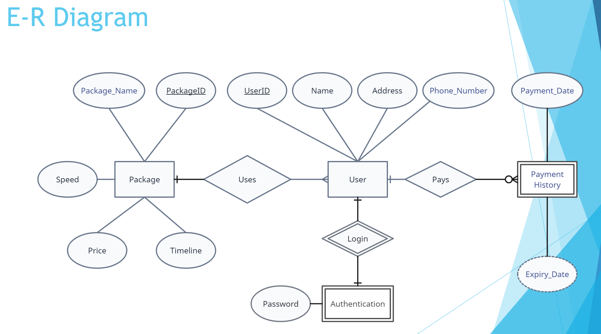
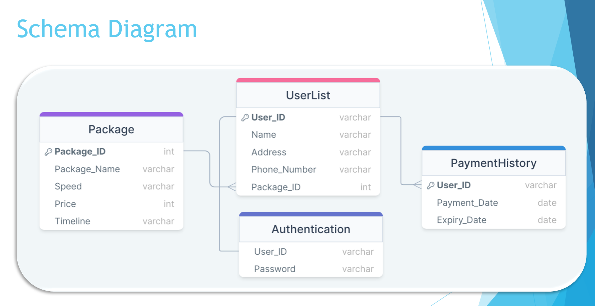
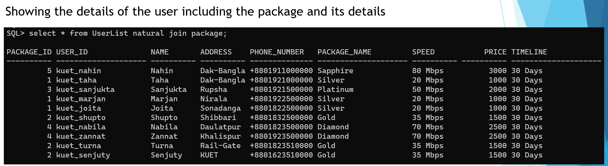
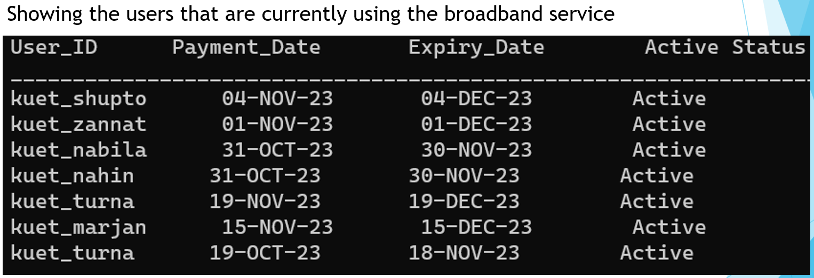

# Broadband User Database

A comprehensive database system for managing broadband internet service users, packages, authentication, and payment tracking. Designed and implemented as part of the **CSE 3209 Database System Laboratory** course.

## 📋 Project Overview

This project demonstrates the complete lifecycle of database design and implementation using ORACLE SQL. It manages a broadband internet service provider's user base, including subscription packages, user information, authentication credentials, and payment history with automated subscription expiry tracking.

## 🗄️ Database Design

### Entity-Relationship Diagram (ER Diagram)
The ER diagram outlines the conceptual structure with four main entities:
- **Package**: Internet service packages with varying speeds and pricing
- **User**: Customer information and package subscriptions
- **Authentication**: Login credentials for users
- **PaymentHistory**: Payment records with automatic expiry date calculation



### Schema Diagram
The schema diagram illustrates the logical database structure with tables, columns, data types, and relationships:



## 📊 Database Structure

### Tables

#### 1. **Package**
Stores broadband service packages with different tiers.

| Column | Data Type | Constraint |
|--------|-----------|-----------|
| Package_ID | NUMERIC(4,0) | Primary Key |
| Package_Name | VARCHAR(20) | NOT NULL |
| Speed | VARCHAR(10) | NOT NULL |
| Price | NUMERIC(4,0) | NOT NULL |
| Timeline | VARCHAR(20) | NOT NULL |

**Available Packages:**
- Silver: 20 Mbps - ৳1000/month
- Gold: 35 Mbps - ৳1500/month
- Platinum: 50 Mbps - ৳2000/month
- Diamond: 70 Mbps - ৳2500/month
- Sapphire: 80 Mbps - ৳3000/month

#### 2. **UserList**
Stores customer information and their subscribed packages.

| Column | Data Type | Constraint |
|--------|-----------|-----------|
| User_ID | VARCHAR(20) | Primary Key |
| Name | VARCHAR(10) | NOT NULL |
| Address | VARCHAR(10) | NOT NULL |
| Phone_Number | VARCHAR(14) | NOT NULL |
| Package_ID | NUMERIC(4,0) | Foreign Key → Package |

#### 3. **Authentication**
Stores user login credentials securely.

| Column | Data Type | Constraint |
|--------|-----------|-----------|
| User_ID | VARCHAR(20) | Foreign Key → UserList |
| Password | VARCHAR(20) | NOT NULL |

#### 4. **PaymentHistory**
Tracks payment records with automatic subscription expiry calculation.

| Column | Data Type | Constraint |
|--------|-----------|-----------|
| User_ID | VARCHAR(20) | Foreign Key → UserList |
| Payment_Date | DATE | NOT NULL |
| Expiry_Date | DATE | Generated (Payment_Date + 30 days) |

## ✨ Key Features

✅ **Normalized Database Design**: Follows 3NF to eliminate data redundancy  
✅ **Relational Integrity**: Foreign key constraints maintain data consistency  
✅ **Automated Expiry Tracking**: Subscription expiry dates automatically calculated  
✅ **Active Subscription Monitoring**: PL/SQL cursor identifies active subscriptions  
✅ **Sample Data**: 10 test users with diverse package subscriptions  
✅ **Multi-tier Packages**: 5 service tiers catering to different customer needs

## 📊 Query Results & Output

### View 1: User-Package Details
Displays all users with their complete package information:



### View 2: Active Subscriptions
Displays users with active subscriptions showing payment dates and expiry status:



## 📊 Sample Data

The database comes pre-loaded with 10 test users:

| User ID | Name | Address | Package | Phone | Package ID |
|---------|------|---------|---------|-------| ---------- |
| kuet_nahin | Nahin | Dak-Bangla | Sapphire (80 Mbps) | +8801911000000 | 5 |
| kuet_taha | Taha | Dak-Bangla | Silver (20 Mbps) | +8801921000000 | 1 |
| kuet_sanjukta | Sanjukta | Rupsha | Platinum (50 Mbps) | +8801921500000 | 3 |
| kuet_marjan | Marjan | Nirala | Silver (20 Mbps) | +8801922500000 | 1 |
| kuet_joita | Joita | Sonadanga | Silver (20 Mbps) | +8801822500000 | 1 |
| kuet_shupto | Shupto | Shibbari | Gold (35 Mbps) | +8801832500000 | 2 |
| kuet_nabila | Nabila | Daulatpur | Diamond (70 Mbps) | +8801823500000 | 4 |
| kuet_zannat | Zannat | Khalispur | Diamond (70 Mbps) | +8801923500000 | 4 |
| kuet_turna | Turna | Rail-Gate | Gold (35 Mbps) | +8801823510000 | 2 |
| kuet_senjuty | Senjuty | KUET | Gold (35 Mbps) | +8801623510000 | 2 |

## 🔑 Key Concepts Demonstrated

- **Primary Keys**: Unique identification of records
- **Foreign Keys**: Maintaining referential integrity between tables
- **Data Types**: Appropriate selection for different data
- **Constraints**: NOT NULL, PRIMARY KEY, FOREIGN KEY
- **Generated Columns**: Automatic calculation of expiry dates
- **Joins**: Natural joins for multi-table queries
- **PL/SQL**: Cursors and conditional logic for complex operations
- **DBMS_OUTPUT**: Formatted output generation

## 📚 Academic Value

This project demonstrates:
- Database normalization principles
- Relational database design
- SQL DDL (CREATE TABLE, constraints)
- SQL DML (INSERT, SELECT)
- PL/SQL programming concepts
- Data integrity and consistency
- Real-world business logic implementation

## 📁 Project Files

```
BroadbandUserDatabase/
├── README.md                 # Project documentation (this file)
├── shuva.sql                 # Main SQL script with DDL, DML, and PL/SQL
├── er_diagram.png            # Entity-Relationship Diagram
├── schema_diagram.png        # Database Schema Diagram
├── view-1.png                # Query output: User details with package information
└── view-2.png                # Query output: Active subscriptions report
```

### For Learning
This project is ideal for understanding:
- Database design methodologies
- Entity-relationship modeling
- Schema normalization
- SQL programming with ORACLE
- PL/SQL fundamentals

### For Reference
Use this as a template for similar projects involving:
- User management systems
- Subscription-based services
- Payment tracking systems
- Service package management

## 🔧 Customization

To extend this database:

**Add New Package:**
```sql
INSERT INTO Package VALUES(6, 'Titanium', '100 Mbps', 3500, '30 Days');
```

**Add New User:**
```sql
INSERT INTO UserList VALUES('user_id', 'Name', 'Address', '+880XXXX', 1);
INSERT INTO Authentication VALUES('user_id', 'password');
```

**Record Payment:**
```sql
INSERT INTO PaymentHistory(User_ID, Payment_Date) VALUES('user_id', SYSDATE);
```

## 📝 Notes

- Passwords in the sample data are for demonstration only
- Subscription timeline is 30 days for all packages
- Payment dates are automatically converted to expiry dates (Payment Date + 30 days)

## 🎓 Course Information

**Course Code:** CSE 3209  
**Course Title:** Database Systems Laboratory 
